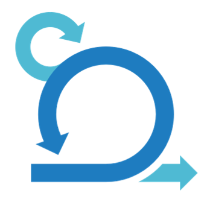

  

<h3 align="left">I'm Agathe, a french 🐸 mechatronics engineer currently working in Sweden </h3>
<h2 align="left" id="about-me">👩 About me</h2>

- **Work:** 	🚚 I'm currently working on hydrogen vehicles as a mechatronics engineer.
- **Hobbies:** 💃 Hula hoop / 🛫 travel / 💻 personnal prejects
- **Language:** 🥖French and 👑 English
- **Contact:** 📧 dalmagathe@gmail.com

 

[][linkedin]

 

<h2 align="left" id="tech">👨‍💻 Programming / OS</h2>

<table>
  <tr>
    <td align="center" width="96">
      
       C++
    </td>
    <td align="center" width="96">
      
       C
    </td>
    <td align="center"  width="96">
      
       Python
    </td>
    <td align="center"  width="96">
      
       Windows
    </td>
    <td align="center"  width="96">
      
       Linux
    </td>
  </tr>
</table>

 

<h2 align="left" id="tech">⚙️ Methods</h2>

<table>
  <tr>
    <td align="center" width="96">
      
       Git
    </td>
    <td align="center" width="96">
      
       Jira
    </td>
    <td align="center"  width="96">
      
       Enterprise Architect
    </td>
    <td align="center"  width="96">
      
       Jenkins
    </td>
    <td align="center"  width="96">
      
       Agile Scrum
    </td>
  </tr>
</table>

 

<h2 align="left" id="tech">🛠️ Tools</h2>

<table>
  <tr>
    <td align="center" width="96">
      
       Solidworks
    </td>
    <td align="center" width="96">
      
       Vector
    </td>
    <td align="center"  width="96">
      
       Qt
    </td>
  </tr>
</table>

 

<h2 align="left" id="stats">🔥 My Github stats</h2>

[linkedin]: https://www.linkedin.com/in/agathe-dalmazir
